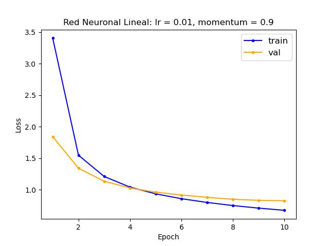
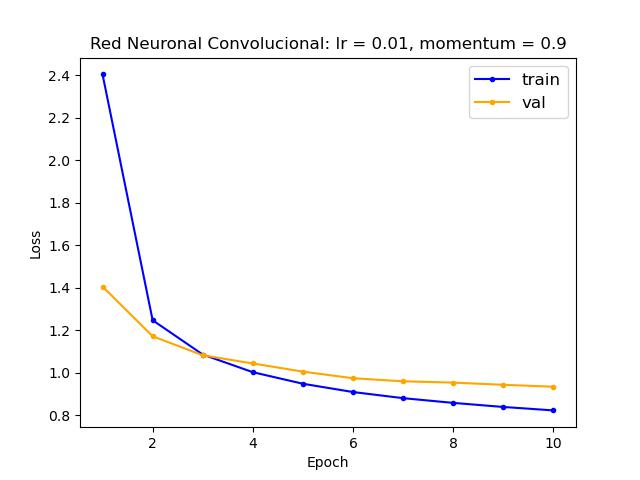
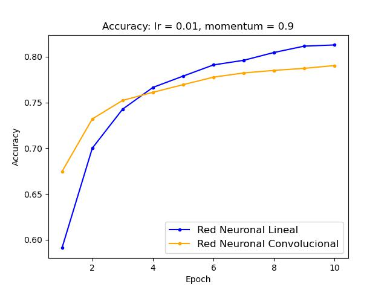

# Aprendizaje Profundo

Integrantes:
    • Candelaria Arpajou: mcarpajou@santafe-conicet.gov.ar 
    • Hugo Folonier: hugofolonier@gmail.com 
    • Gustavo Jaca: gustavojaca@gmail.com 
    • Nicolas Rosales: elnicorosales@gmail.com 

Para descargar el meli-challenge-2019:
!curl -L https://cs.famaf.unc.edu.ar/\~ccardellino/resources/diplodatos/meli-challenge-2019.tar.bz2 -o ./data/meli-challenge-2019.tar.bz2
!tar jxvf ./data/meli-challenge-2019.tar.bz2 -C ./data/

Para descargar SBW-vectors-300-min5.txt.bz2:
https://crscardellino.ar/SBWCE/

Para descargar los modelos: https://drive.google.com/drive/folders/12pUWdT36ftxQbLw72IvZEG_i8wYz7yJl?usp=sharing

# Resultados

## Red Neuronal Lineal

### Modelo:

SuperSimpleMLP(
  (embeddings): Embedding(50002, 300, padding_idx=0)
  (hidden_layer1): Linear(in_features=300, out_features=512, bias=True)
  (hidden_layer2): Linear(in_features=512, out_features=8192, bias=True)
  (hidden_layer3): Linear(in_features=8192, out_features=1024, bias=True)
  (output_layer): Linear(in_features=1024, out_features=632, bias=True)
)
### Loss:

## Red Neuronal Convolucional

### Modelo:

SuperSimpleConv(
  (embeddings): Embedding(50002, 300, padding_idx=0)
  (convs): ModuleList(
    (0): Conv1d(300, 100, kernel_size=(2,), stride=(1,))
    (1): Conv1d(300, 100, kernel_size=(3,), stride=(1,))
    (2): Conv1d(300, 100, kernel_size=(4,), stride=(1,))
  )
  (fc): Linear(in_features=300, out_features=1024, bias=True)
  (output_layer): Linear(in_features=1024, out_features=632, bias=True)
)

### Loss:

### Balanced Accuracy Score:

